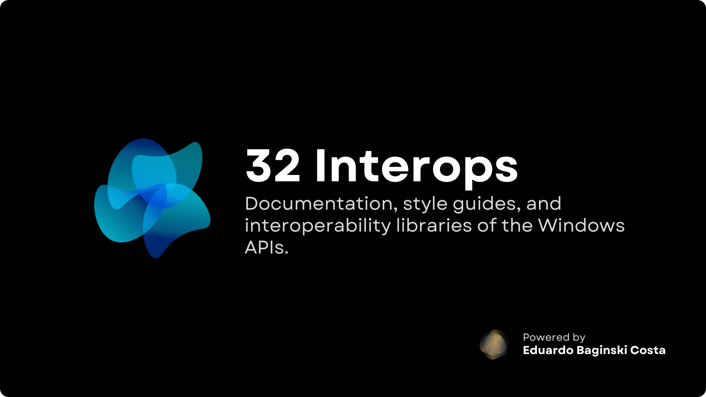

<h1 align="center">ThirtyTwo Interops</h1>

  We are committed to bringing complete and well-structured documentation, style guides, and interoperability libraries of all Windows APIs to the Open Source community, covering various frameworks and programming languages.

