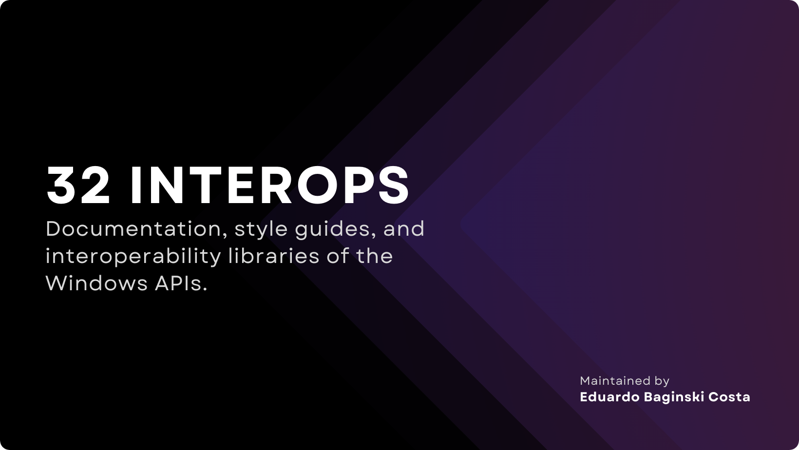

<h1 align="center">ThirtyTwo Interops</h1>

  We are dedicated to providing the open-source community with comprehensive and well-structured documentation, style guides, and
  interoperability libraries for all Windows APIs. Our goal is to cover a variety of frameworks and programming languages, reinforcing
  our commitment to accessibility and innovation.

  <b>
    Maintained by <a href="https://github.com/eduardobaginskicosta" alt="Eduardo Baginski Costa profile">@eduardobaginskicosta</a>
  </b>.

